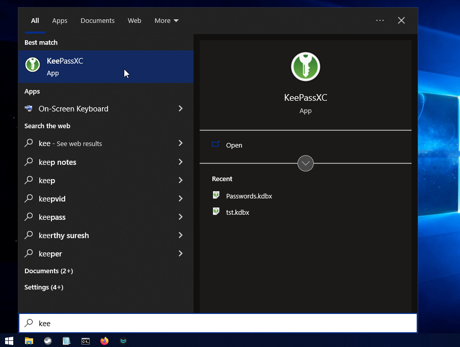
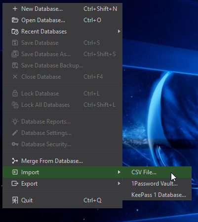
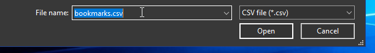

# mozilla-bookmark-html-2-keepassxc-csv

# Firefox Bookmarks to KeePassXC Database

##### Converts a Mozilla Firefox bookmarks-HTML file to a CSV file format that is accepted by the KeePassXC password manager.

Do you test different browsers on occasion?

Then, you might be interested in [KeePassXC](https://keepassxc.org/), a password manager which can be used for bookmarks management along with passwords. To use KeePassXC, first, you'll have to bring your existing browser bookmarks to KeePassXC. Browsers such as Mozilla Firefox allow exporting bookmarks stored in the browsers. Ideally, you'll have to export your bookmarks from the browser as an HTML file that can later be transferred to other browsers or bookmarking services on other devices.

KeePassXC, on the other hand, doesn't allow importing HTML database files; it accepts a few file formats for import, of which CSV is the primary means of transferring data from other password managers to KeePassXC.

`html2csv` will help you to convert that browser bookmark database into a CSV file that KeePassXC recognises.

## How will you use `html2csv`?

```
html2csv bookmarks.html bookmarks.csv
```

As of now, you'll have to build the program so that you can use it. I haven't included any binary files til now. It is on my TODO list.

## Let's build the program

Clone the repository.

```
git clone https://github.com/Pinaki82/mozilla-bookmark-html-2-keepassxc-csv.git
```

```
cd mozilla-bookmark-html-2-keepassxc-csv/
```

You'll need [CMake](https://cmake.org/) and [MinGW-w64](https://www.mingw-w64.org/) to build the program on Windows. I use an all-in-one solution, [MSYS2](https://www.msys2.org/). MSVC can be used, but I don't have access to one such compiler at the moment.

Build the program.

```
mkdir build
```

```
cd build
```

For a 'MinGW-w64' based solution,

```
cmake -G "MinGW Makefiles" ..
```

```
mingw32-make -j4
```

On Linux:

```
cmake -G "GNU Makefiles" ..
```

```
make -j4
```

Use `j4` or `j2` depending on the number of cores in your computer. `j4` for `4` cores.

Enter the `build` directory and copy the file to somewhere (your preferred location). On Linux, you may prefer `install -m +x html2csv $HOME/.local/bin`. The executable file has to be accessible. If you cannot decide, keep the program alongside your `bookmarks.html` for ease of use. Give the compiled binary necessary execution permissions `chmod +x html2csv`.

## The Internal Workings

Here's a sample HTML bookmarks file exported by Mozilla Firefox 111.0.1 Windows x64.

```html
<DL><p>
  <DT><H3 ADD_DATE="1661171785" LAST_MODIFIED="1679567379">Mozilla Firefox</H3>
  <DL><p>
      <DT><A HREF="https://support.mozilla.org/products/firefox" ADD_DATE="1661171785" LAST_MODIFIED="1679567379">Get Help</A>
      <DT><A HREF="https://support.mozilla.org/kb/customize-firefox-controls-buttons-and-toolbars?utm_source=firefox-browser&utm_medium=default-bookmarks&utm_campaign=customize" ADD_DATE="1661171785" LAST_MODIFIED="1679567379">Customize Firefox</A>
      <DT><A HREF="https://www.mozilla.org/contribute/" ADD_DATE="1661171785" LAST_MODIFIED="1679567379">Get Involved</A>
      <DT><A HREF="https://www.mozilla.org/about/" ADD_DATE="1661171785" LAST_MODIFIED="1679567379">About Us</A>
  </DL><p>
  ...
```

KeePassXC imports password/bookmark databases in CSV (another Spreadsheet-like text-based) format. We will have to import the DB and convert it to KeePassXC's native *.kdbx format before we can use it.

Here's a sample CSV file that KeePassXC can accept.

```csv
"Group","Title","Username","Password","URL","Notes","TOTP","Icon","Last Modified","Created"
"Root","firefox addons","","",https://addons.mozilla.org/en-US/firefox/,"","","0","2023-03-23T11:24:26Z","2023-03-23T11:24:18Z"
"Root/group","chatgpt","","",https://chat.openai.com/chat,"","","0","2023-03-23T11:24:43Z","2023-03-23T11:24:36Z"
"Root/group/sub-group","g calender","","",https://calendar.google.com/calendar,"","","0","2023-03-23T11:25:01Z","2023-03-23T11:24:52Z"
```

By now, we know the pattern in which KeePassXC keeps the database elements arranged.

So, we now have narrowed down our focus on the converted CSV file if it has to be generated from the given HTML sample input as follows:

```csv
"Group","Title","Username","Password","URL","Notes","TOTP","Icon","Last Modified","Created"
"Mozilla Firefox","Get Help","","",https://support.mozilla.org/products/firefox,
"Mozilla Firefox","Customize Firefox","","",https://support.mozilla.org/kb/customize-firefox-controls-buttons-and-toolbars?utm_source=firefox-browser&utm_medium=default-bookmarks&utm_campaign=customize,
"Mozilla Firefox","Get Involved","","",https://www.mozilla.org/contribute/,
"Mozilla Firefox","About Us","","",https://www.mozilla.org/about/,
```

## The KeePassXC part



Database -> Import -> CSV File...



Navigate to the directory where you have your converted CSV file.



KeePassXC doesn't allow screen capture in most windows.

Hear me out.

Change the `Database Name', maybe from 'Passwords' to 'bookmarks'. Fill in the 'Description' field if you think.

Press 'Continue'.

Leave everything to the default settings.

In the next section, choose a moderately strong password for the DB. Select 'Add Additional Protection' to protect the DB with an extra layer of security, namely a key file. Generate a key file, e.g., 'bookmarks.keyx'. Press 'Done'.

Depending on the size of your database, the CSV import process might take a few minutes. Save the file as 'bookmarks.kdbx' first.

Press 'Ok'.

## Pro Tips:

Are you using [Keepass2Android](https://play.google.com/store/apps/details?id=keepass2android.keepass2android) on your phone? They have an offline version also. The offline version is the same app, but it doesn't connect to the internet. [Keepass2Android Offline](https://play.google.com/store/apps/details?id=keepass2android.keepass2android_nonet). Try it if you're not.

The most important thing I should mention is that do not download Favicon icons (small shortcut icons) to your links for the bookmark database. If  you do, you'll only make the database heavy. Since you'll have to open it frequently on your phone and other devices, you should keep things as lightweight as possible.

Before exporting bookmarks from Firefox, try removing duplicate links. An excellent extension is at the disposal of Firefox users, [Bookmark Dupes](https://addons.mozilla.org/en-US/firefox/addon/bookmark-dupes/).
